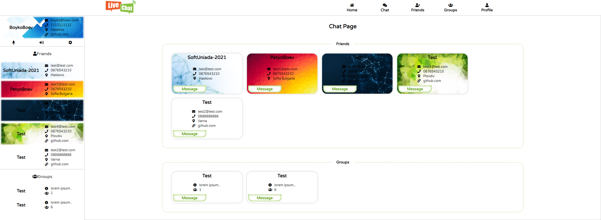
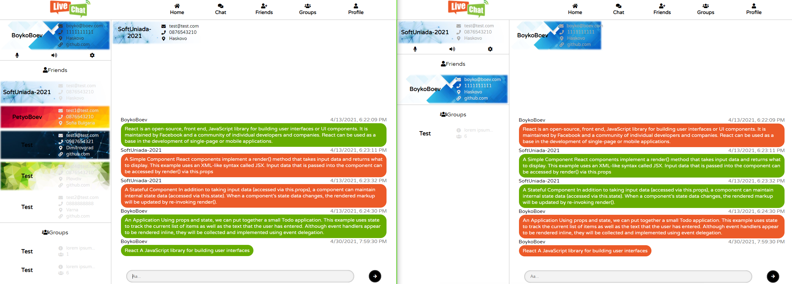
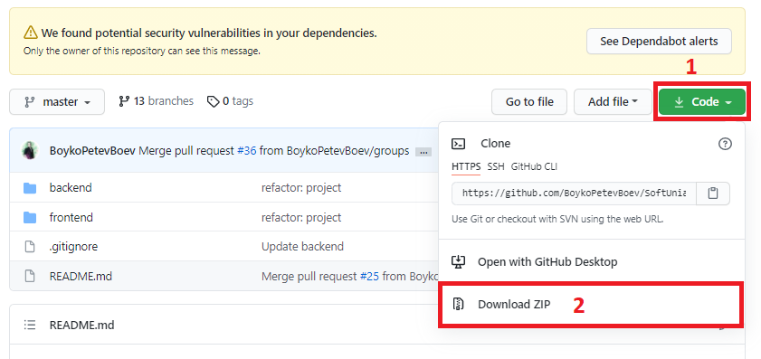

## Live Chat
Проектът представлява чат приложение, което позволява на потребителите да изпращат текстови съобщения и да създават групи със своите приятели.

## Категория
Уеб приложение.

## Възрастова група
Над 16 години.

## Описание
* Какъв проблем решава?
LiveChat е приложение за обмен на текстови съобщения в реално време.  Потребителите могат да участват в групи, както и да разменят съобщения в лични чат стаи. Всеки регистриран потребител може да персонализира своя профил с допълнителна информация. Приложението позволява създаване на лични групи в които участниците могат да общуват помежду си. Също така има и публични групи които са достъпни за всички регистрирани потребители.

* За кого е предназначен проектът?
Проектът е предназначен за всички потребители без възрастови ограничения. Има опростен дизайн, който е лесен и приятен за използване.  

* С какво е уникален проектът?
Проектът наподобява най-използваните чат приложения, като тук потребителите могат да добавят допълнителна информация за връзка, като телефон, имейл и др. структурирана под формата на визитна картичка.  

* Завършен ли е проектът или е само прототип?
Проектът не е напълно завършен. Поддържат се основните функционалности, като регистрация и управление на профила на потребителите, управление на приятелите, размяна на текстови съобщения и създаване на групи. Има множество други функционалности, които могат да се добавят за да улеснят комуникацията между потребителите.	


## Screenshots
Изглед на основната страница, която съдържа всички приятели на потребителя, както и групите в които той участва.


Изглед на чат стая от двамата потребители.


## Екип
 Бойко Боев - разработил целия проект.
* SoftUni username: **boykoboev**
* Tel. **0876 550 806**
* E-mail: **boykopetevboev@gmail.com**

## Линк за изтегляне / демо / видео
* Стъпка 1 – Изтегляне на проекта
Отворете адрес:  [https://github.com/BoykoPetevBoev/SoftUniada-2021](https://github.com/BoykoPetevBoev/SoftUniada-2021)
 
Изтеглете ZIP файла, както е показано на снимката по-горе и го разархивирайте в папка по избор.

*	Стъпка 2 – Стартиране на сървъра
Отворете терминал в папка *backend* 
Инсталирайте пакетите чрез команда 
```npm install```
Стартирайте сървъра чрез команда 
```npm start```

*	Стъпка 3 – Стартиране на клиента
Отворете терминал в папка *frontend*
Инсталирайте пакетите чрез команда 
```npm install```
Стартирайте клиента чрез команда 
```npm start```

*	Стъпка 4 
Отворете [http://localhost:3000/](http://localhost:3000/)
Можете да използвате вече създаден акаунт 
Email:  **test@test.com**
Password: **123**


## Технологии
Използвани технологии: 
*	HTML
*	CSS
*	JavaScript
*	React
*	Express
*	Mongoose
*	Socket.io
*	Jest


## Сорс код
Линк към сорс кода: [https://github.com/BoykoPetevBoev/SoftUniada-2021](https://github.com/BoykoPetevBoev/SoftUniada-2021)

## Подробно описание
По желание се предоставя подробна документация по проекта. Тя може да е по-обемна и
може да съдържа:
• Потребителско ръководство с инструкции за използване и снимки на екрана.
• Техническа документация: архитектура, дизайн решения, използвани технологии,
други.
• Друга информация, свързана с проекта.

<hr>

## Terminal Cheat Sheet

| Commands | Notes |
| -------- | ----- |
| `mkdir`  | create new directory |
| `rmdir <FolderName>`  | remove directory |
| `touch <FileName>` | create new file |
| `open ` | open file |
| `rmd` | delete file |
| `explorer .` | ppen a file explorer in current directory |

## Working with Git

| Commands | Notes |
| -------- | ----- |
| `git init` | initializes the repository |
| `git chechout master` | use master branch |
| `git chechout -b <BranchName>` | create new local branch |
| `git branch -d <Branchname>`   | deletes local branch |
| `git push origin master` | send changes to the master branch of your remote repository |
| `git pull` | fetch and merge changes on the remote server to your working directory |
| `git status` | show those *unknown* files |
| `git add .` |  add those *unknown* files |
| `git commit -m "message"` |  commit all changes |
| `git push` | push changes in GitHub |

### Git commit in Master
1. `git status`
2. `git add .`
3. `git commit -m "message"` 
4. `git push`

### Git commit in branch
1. `git checkout master`
2. `git pull`
3. `git checkout -b "branch-name"`
4. `...`
5. `git status`
6. `git add .`
7. `git commit -m "message"` 
8. `git push --set-upstream origin branch-name`
